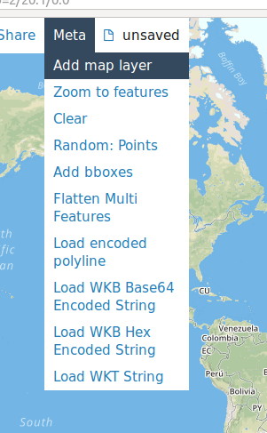
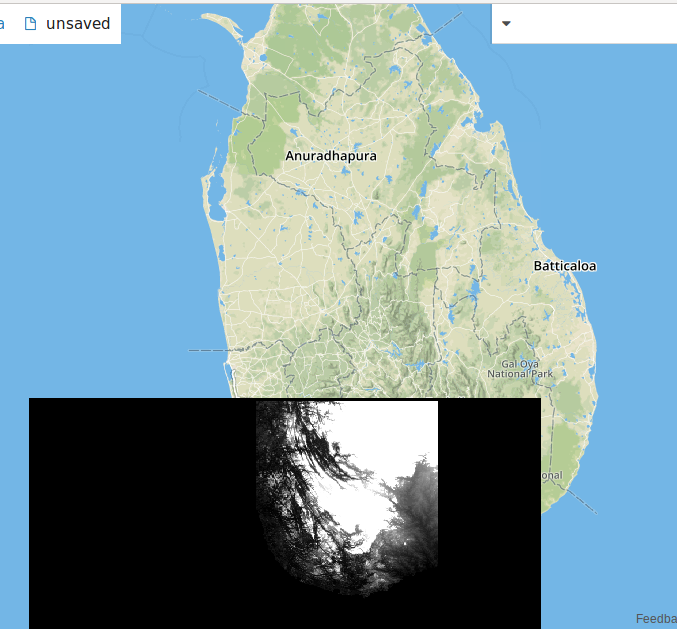

.. _greyscale_tile_server:

Creating a Tile Server From Ingested, Greyscale Data
*****************************************************

Now that we have ingested data, we can use it using a tile server.
We will be using the catalog that was created in :ref:`greyscale_ingest_example`.

**Note**: GeoPySpark can create a tile server from a catalog that was created
via GeoTrellis!

The Code
=========

Here is the code itself. We will be using ``flask`` to create a local server
and ``PIL`` to create our images. For this example, we are working with
singleband, grayscale images; so we do not need to worry about color
correction.

.. code:: python

  import io
  import numpy as np

  from PIL import Image
  from flask import Flask, make_response
  from geopyspark.geopycontext import GeoPyContext
  from geopyspark.geotrellis.catalog import read_value
  from geopyspark.geotrellis.constants import SPATIAL

  app = Flask(__name__)

  @app.route("/<int:zoom>/<int:x>/<int:y>.png")
  def tile(x, y, zoom):

      # fetch tile
      tile = read_value(geopycontext,
                        SPATIAL,
                        uri,
                        layer_name,
                        zoom,
                        x,
                        y)

      data = np.int32(tile['data']).reshape(256, 256)

      # display tile
      bio = io.BytesIO()
      im = Image.fromarray(data).resize((256, 256), Image.NEAREST).convert('L')
      im.save(bio, 'PNG')

      response = make_response(bio.getvalue())
      response.headers['Content-Type'] = 'image/png'
      response.headers['Content-Disposition'] = 'filename=%d.png' % 0

      return response

  if __name__ == "__main__":
      uri = "file:///tmp/python-catalog/"
      layer_name = "python-ingest"

      geopycontext = GeoPyContext(appName="server-example", master="local[*]")

      app.run()

.. _running_code:

Running the Code
-----------------

You will want to run this code through the command line. To run it, from the
file, go to the directory the file is in and run this command

.. code-block:: none

  python3 file.py

Just replace ``file.py`` with whatever name you decided to call the file.

Once it's started, you'll then want to go to a website that allows you to
display geo-spatial images from a server. For this example, we'll be using
`geojson.io <http://geojson.io>`_, but feel free to use whatever service you
want.

.. image:: pictures/geojson.png
   :align: center

Go to geojson.io, and select the ``Meta`` option from the tool bar, and then
choose the ``Add map layer`` command.

A pop up will appear where it will ask for the template, layer URL. To get this example to work,
please enter the following: ``http://localhost:5000/{z}/{x}/{y}.png``.

.. image:: pictures/address.png
   :align: center

A second window will appear asking to name the new layer. Pick whatever you want.
I tend to use simple names like ``a``, ``b``, ``c``, etc.

Now that everything is setup, it's time to see the image. You'll need to scroll
in to Sri Lanka and a black-and-white elevation map should appear. If what
you're seeing matches the image above, then the tile server works!

.. _server_break_down:

Breaking Down the Code
=======================

As with our other examples, let's go through it step-by-step to see what's
actually going on. Though, for this example, we'll be starting at the bottom
and working our way up.

Setup
------

.. code-block:: python

  if __name__ == "__main__":
      uri = "file:///tmp/python-catalog/"
      layer_name = "python-benchmark"

      geopycontext = GeoPyContext(appName="server-example", master="local[*]")

      app.run()

Before getting the tiles, we'll need to setup some constants that will be used.
In this case, the ``uri``, ``layer_name``, and GeoPyContext will remain the
same each time a tile is fetched. This is also where ``flask`` is started via
``app.run()``.

Fetching the Tile
------------------

.. code-block:: python

  app = Flask(__name__)

  @app.route("/<int:zoom>/<int:x>/<int:y>.png")
  def tile(x, y, zoom):

      # fetch tile
      tile = read_value(geopycontext,
                        SPATIAL,
                        uri,
                        layer_name,
                        zoom,
                        x,
                        y)

      data = np.int32(tile['data']).reshape(256, 256)

      # display tile
      bio = io.BytesIO()
      im = Image.fromarray(data).resize((256, 256), Image.NEAREST).convert('L')
      im.save(bio, 'PNG')

      response = make_response(bio.getvalue())
      response.headers['Content-Type'] = 'image/png'
      response.headers['Content-Disposition'] = 'filename=%d.png' % 0

      return response

This section of the code is where the tile read from the catalog and made into
a PNG which can then be displayed. Because the tiles are stored as a grid
within the catalog, giving the ``zoom level``, ``col``, and ``row`` of the tile
will allow us to retrieve it.

:meth:`~geopyspark.geotrellis.catalog.read_value` returns a :ref:`raster`, so
we take out the underlying ``data`` and place it into a new NumPy array where
the data type is ``int32``.

Once we have the NumPy array, we can turn it into an ``Image`` which we can
then turn into a PNG. We turn this PNG into a ``flask`` ``response``, which
allows the tiles themselves to viewed on geojson.io.
