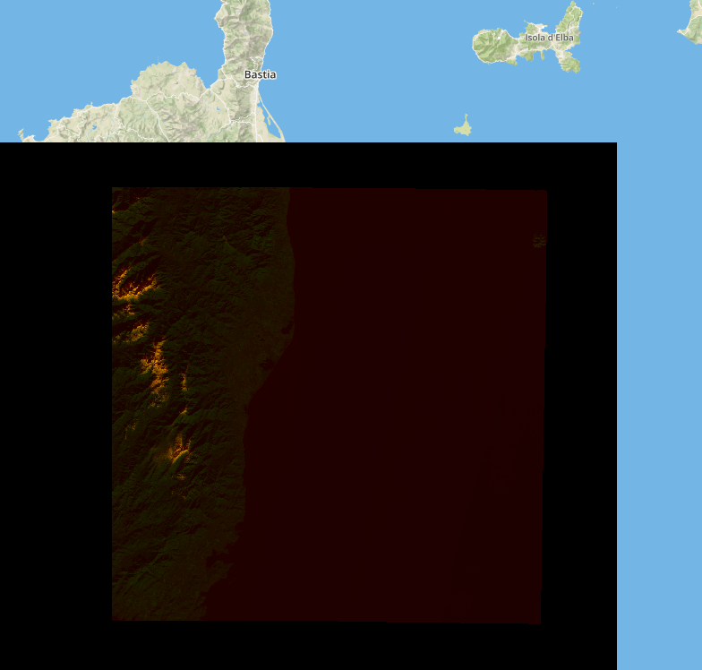

Creating a Tile Server From Ingested, Sentinel Data
****************************************************

Now that we have ingested data, we can use it using a tile server.
We will be using the catalog that was created in :ref:`sentinel_ingest_example`.

**Note**: This guide will focus on converting the raster into a ``PIL`` RGB
image so that it can be used by the tile server. The tile server process itself
is discussed in more detail in :ref:`Greyscale Tile Server Code Breakdown
<server_break_down>`.

The Code
=========

Because we are working with a RGB, a multiband image, we will need to correct the
colors for each tile in order for it to displayed correctly.

.. code:: python

  import io
  import numpy as np
  import rasterio

  from flask import Flask, make_response
  from PIL import Image

  from geopyspark.geopycontext import GeoPyContext
  from geopyspark.geotrellis.catalog import read_value
  from geopyspark.geotrellis.constants import SPATIAL

  # normalize the data so that it falls in the range of 0 - 255
  def make_image(arr):
      adjusted = ((arr - whole_min) * 255) / (whole_max - whole_min)
      return Image.fromarray(adjusted.astype('uint8')).resize((256, 256), Image.NEAREST).convert('L')

  app = Flask(__name__)

  @app.route("/<int:zoom>/<int:x>/<int:y>.png")
  def tile(x, y, zoom):
      # fetch tile

      tile = read_value(geopysc, SPATIAL, uri, layer_name, zoom, x, y)
      arr = tile['data']

      bands = arr.shape[0]
      arrs = [np.array(arr[x, :, :]).reshape(256, 256) for x in range(bands)]

      # display tile
      images = [make_image(arr) for arr in arrs]
      image = Image.merge('RGB', images)

      bio = io.BytesIO()
      image.save(bio, 'PNG')
      response = make_response(bio.getvalue())
      response.headers['Content-Type'] = 'image/png'
      response.headers['Content-Disposition'] = 'filename=%d.png' % 0

      return response

  if __name__ == "__main__":
      uri = "file:///tmp/sentinel-catalog"
      layer_name = "sentinel-example"

      geopysc = GeoPyContext(appName="s3-flask", master="local[*]")

      with open('/tmp/sentinel_stats.txt', 'r') as f:
          lines = f.readlines()
          whole_max = int(lines[0])
          whole_min = int(lines[1])

      app.run()

Running the Code
-----------------

Running the tile server is done the same way as in :ref:`Greyscale Tile Server
Running the Code <running_code>`. The only difference being the resulting
image, of course.

You'll need to scroll over Corsica, and you should see something that matches
the above image. If you do, then the server works!

Breaking Down the Code
=======================

This next section will go over how to prepare the RGB image to be
served. For a more of a general overview of to setup a tile server please see
:ref:`Greyscale Tile Server Code Breakdown <server_break_down>`.

Setup
------

.. code-block:: python

  if __name__ == "__main__":
      uri = "file:///tmp/sentinel-catalog"
      layer_name = "sentinel-example"

      geopysc = GeoPyContext(appName="s3-flask", master="local[*]")

      with open('/tmp/sentinel_stats.txt', 'r') as f:
          lines = f.readlines()
          whole_max = int(lines[0])
          whole_min = int(lines[1])

      app.run()

In additon to setting up ``uri`` and ``layer_name``, we will also read in the
``max`` and ``min`` values that we saved earlier. These will be used when we
normalize a tile.

Preparing the Tile
------------------

.. code-block:: python

  # normalize the data so that it falls in the range of 0 - 255
  def make_image(arr):
      adjusted = ((arr - whole_min) * 255) / (whole_max - whole_min)
      return Image.fromarray(adjusted.astype('uint8')).resize((256, 256), Image.NEAREST).convert('L')

  app = Flask(__name__)

  @app.route("/<int:zoom>/<int:x>/<int:y>.png")
  def tile(x, y, zoom):
      # fetch tile

      tile = read_value(geopysc, SPATIAL, uri, layer_name, zoom, x, y)
      arr = tile['data']

      bands = arr.shape[0]
      arrs = [np.array(arr[x, :, :]).reshape(256, 256) for x in range(bands)]

      # display tile
      images = [make_image(arr) for arr in arrs]
      image = Image.merge('RGB', images)

Tiles that contain multibands need some work done before they can be served.
The ``make_image`` method takes each band and normalizes it between a range
of 0 and 255. We need to do this because ``PIL`` expects the data types of
arrays to be ``uint8``. This is why we need the ``whole_max`` and the
``whole_min`` values; as we needed to know full range of the original values
before normalization. Information that would be otherwise impossible to get at
this point.

Once normalized, the band is then converted to a greyscale image. This is done
for each band in the tile, and once complete, we can then make a RGB ``png``
file. After this step, the remaining process is no different than if you were
working with a singleband tile.

Any details that we not discussed in this document can be found in
:ref:`Greyscale Tile Server Code Breakdown <server_break_down>`.
